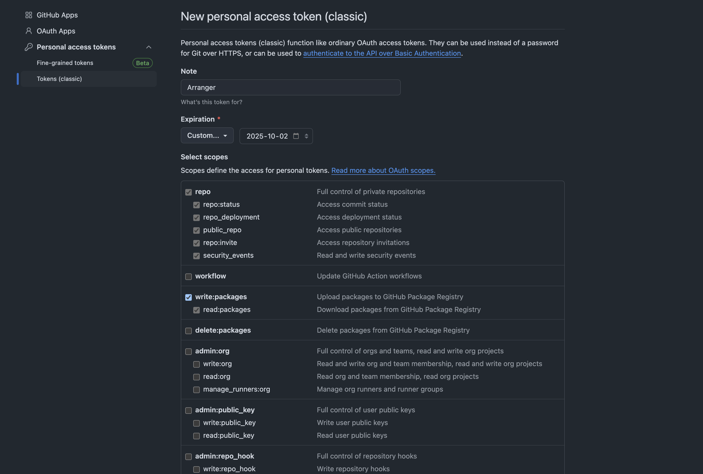

# UI Components

This folder contains only the front-end code base of the arranger project.

## Development Setup

Make sure you are checked out in the `portal-ui` branch.

Ensure you are using node version `14.19.0` and npm version `6.14.6`. To manage different versions of node, we recommend using a [node version manager.](https://github.com/tj/n)
Please note Portal uses version node version `16.13.2` and npm version `9.1.2`

Inside of `modules/components` you will need to create a file called `.npmrc`. This file is required to publish updates and properly installing the dependencies for this project.The `components` module is to be published in order for Portal to consume the latest changes. In this file you will need to add the following:

```
@pilotdataplatform:registry=https://npm.pkg.github.com
//npm.pkg.github.com/:_authToken=<PERSONAL_ACCESS_TOKEN>
```

If you do not have a personal access token you will need to create one via github. Hover over your profile, go to settings > developer settings > personal access tokens > Tokens (classic). Set the expiry date to a year from the date of creation and ensure you have selected only **_read and write package_** permissions.

<br></br>

<br></br>

Now we're ready to install the packages. Ensure you are in `modules/components` and input `npm install` in the terminal. If you encounter any issues with installing your packages, it is likely your token has expired. Create a new token and replace the old one in the `.npmrc` file. If this does not resolve your issue, the error message in the terminal should display a file path to inspect your logs for more detailed troubleshooting.

Create .env file using .env.schema as an example, make sure the .env variable is updated with our current keycloak dev environment.

Upon completing the installation, input `npm run start` to start up the local server. Once it loads you will be required to login with your dev environment credentials, or if you have an instance of the dev environment opened you will be logged in automatically.

`modules/components/src/App.js` is the entry point of the local development server.

## Publishing

### Arranger

Once you have finished with your changes, the components module will have to be published. In order to do so, first increment the version number in `module/components/package.json`. In the terminal input `npm publish`. Using your credentials in the `.npmrc` file, this script will build the project and publish it to github's package repo.

### Portal

To get the latest updates, ensure you run `npm install` for the latest version of the arranger package. For example, to install arranger version `1.5.11` you will need to input `npm install @pilotdataplatform/arranger-components/@1.5.11`.

Upon updating the version, ensure it runs correctly locally and submit the changes through a PR.
